## Home Service Management System - software Architecture

## 1. Scope
(To be filled)

## 2. References
(To be filled)

## 3. Software Architecture
### 3.1 Architecture Overview

The system is designed using a three-tier architecture, which separates the application into three main layers: presentation, application, and data layers. This architectural style is chosen to ensure a clear separation of concerns and to improve system maintainability, scalability, and flexibility.

Each layer has a specific responsibility, allowing the system to be developed, modified, and extended more easily. This structure also supports future enhancements and efficient system management.

  

<b>Figure 3.1:</b> 3-Tier Architecture of Home Service System

---

### 3.2 Layer Description

#### Presentation Layer

The presentation layer is responsible for the user interface of the system. It allows customers, employees, and administrators to interact with the application through web pages. It provides features such as login, service browsing, request creation, and profile management.

#### Application Layer

The application layer contains the business logic of the system. It processes user requests, manages services, handles service requests, and controls system operations. It acts as a bridge between the user interface and the database.

#### Data Layer

The data layer is responsible for storing and managing all system data. It includes information related to users, employees, services, service requests, and reviews. The application layer communicates with the database to retrieve and update data as needed.

This layered architecture improves maintainability, scalability, and separation of concerns.

---

### 3.3 Layer Interaction

The system follows a layered interaction where each layer communicates with the adjacent layer.

The user interacts with the presentation layer through the web interface. The presentation layer sends user requests to the application layer, where the business logic is executed. The application layer processes the request and communicates with the data layer to retrieve or store data.

After processing, the data is returned to the application layer, which then sends the response back to the presentation layer. Finally, the presentation layer displays the results to the user.

This structured interaction ensures a clear separation of responsibilities between layers and improves system maintainability and scalability.

## 4. Architectural Goals & Constraints

### 4.1 Architectural Goals

The architecture of the system is designed to meet both functional and non-functional requirements.

#### Functional Goals

- The system should allow users to search for home services easily  
- The system should enable customers to request services from employees  
- Employees should be able to accept or reject service requests  
- The admin should manage services, employees, and system activities  

#### Non-Functional Goals

- **Usability:** The system should provide an easy-to-use interface for all users  
- **Performance:** The system should respond quickly to user actions  
- **Security:** User data should be protected through authentication and authorization  
- **Scalability:** The system should support future growth  
- **Maintainability:** The system should be easy to update and modify
---

### 4.2 Constraints

- The system does not support mobile application (web only)  
- The project is limited by time constraints  
- The system is designed for moderate usage, not large-scale enterprise deployment  
- Security implementation is limited to basic authentication mechanisms  
- The database design may evolve during development  
- Limited development experience of team members  
- Scalability is limited in the current version of the system  
- The system depends on internet connectivity for operation  

These goals and constraints guide the design decisions and define the limitations of the current system implementation.

## 5. Logical Architecture
  ## 5. Logical Architecture

The logical view describes the key functional abstractions of the Home Service Marketplace system as seen by the end-user. It focuses on what the system does — the entities involved, their responsibilities, and how they relate and evolve over time. This view is represented using a UML Class Diagram and a set of State Diagrams.

---

### 5.1 Class Diagram

The class diagram captures the primary domain entities of the system and their structural relationships. Only class names and associations are shown to keep the diagram clean and focused on architecture rather than implementation detail.

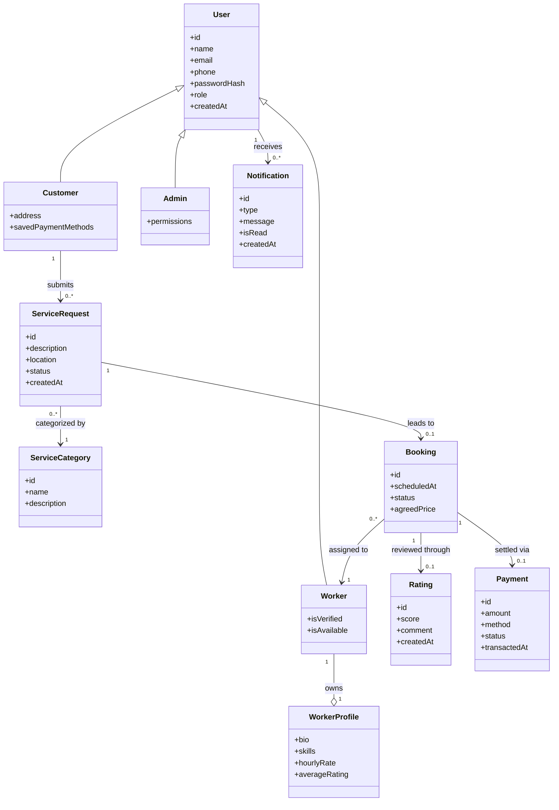
```mermaid
classDiagram

    class User {
        +id
        +name
        +email
        +phone
        +passwordHash
        +role
        +createdAt
    }

    class Customer {
        +address
        +savedPaymentMethods
    }

    class Worker {
        +isVerified
        +isAvailable
    }

    class Admin {
        +permissions
    }

    class WorkerProfile {
        +bio
        +skills
        +hourlyRate
        +averageRating
    }

    class ServiceCategory {
        +id
        +name
        +description
    }

    class ServiceRequest {
        +id
        +description
        +location
        +status
        +createdAt
    }

    class Booking {
        +id
        +scheduledAt
        +status
        +agreedPrice
    }

    class Rating {
        +id
        +score
        +comment
        +createdAt
    }

    class Payment {
        +id
        +amount
        +method
        +status
        +transactedAt
    }

    class Notification {
        +id
        +type
        +message
        +isRead
        +createdAt
    }

    User <|-- Customer
    User <|-- Worker
    User <|-- Admin

    Worker "1" --o "1" WorkerProfile : owns

    Customer "1" --> "0..*" ServiceRequest : submits
    ServiceRequest "0..*" --> "1" ServiceCategory : categorized by
    ServiceRequest "1" --> "0..1" Booking : leads to

    Booking "0..*" --> "1" Worker : assigned to
    Booking "1" --> "0..1" Rating : reviewed through
    Booking "1" --> "0..1" Payment : settled via

    User "1" --> "0..*" Notification : receives
```

---

### 5.2 State Diagrams

State diagrams describe the lifecycle of the most behaviourally significant entities in the system — those whose status changes drive key interactions between actors.

---

#### 5.2.1 Service Request

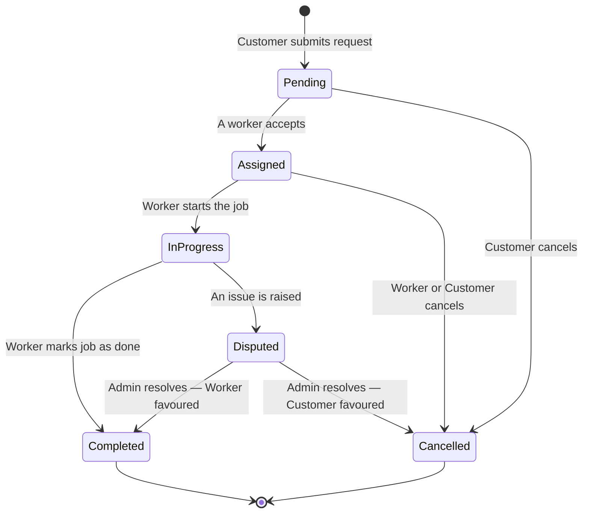
```mermaid
stateDiagram-v2
    [*] --> Pending : Customer submits request

    Pending --> Assigned : A worker accepts
    Pending --> Cancelled : Customer cancels

    Assigned --> InProgress : Worker starts the job
    Assigned --> Cancelled : Worker or Customer cancels

    InProgress --> Completed : Worker marks job as done
    InProgress --> Disputed : An issue is raised

    Disputed --> Completed : Admin resolves — Worker favoured
    Disputed --> Cancelled : Admin resolves — Customer favoured

    Completed --> [*]
    Cancelled --> [*]
```

---

#### 5.2.2 Booking

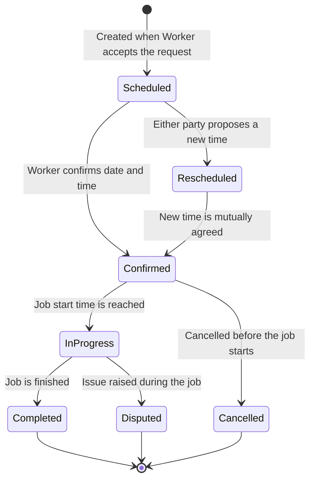
```mermaid
stateDiagram-v2
    [*] --> Scheduled : Created when Worker accepts the request

    Scheduled --> Confirmed : Worker confirms date and time
    Scheduled --> Rescheduled : Either party proposes a new time

    Rescheduled --> Confirmed : New time is mutually agreed

    Confirmed --> InProgress : Job start time is reached
    Confirmed --> Cancelled : Cancelled before the job starts

    InProgress --> Completed : Job is finished
    InProgress --> Disputed : Issue raised during the job

    Completed --> [*]
    Cancelled --> [*]
    Disputed --> [*]
```

---

#### 5.2.3 Payment

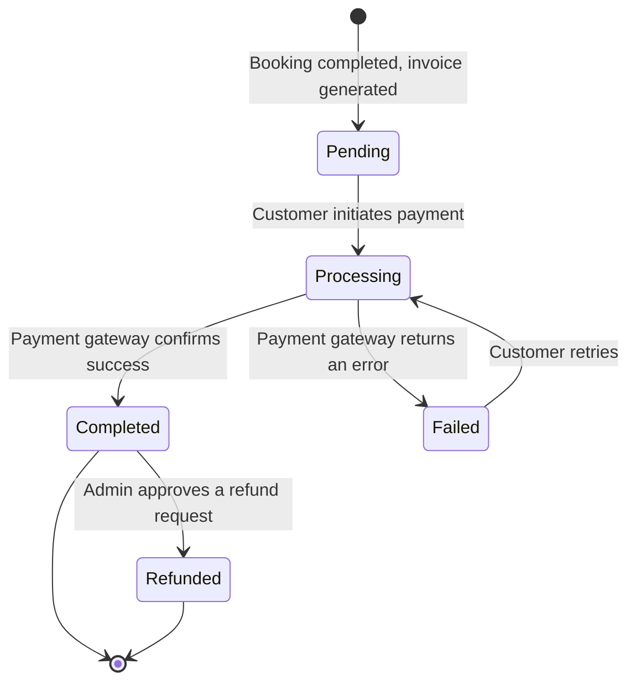
```mermaid
stateDiagram-v2
    [*] --> Pending : Booking completed, invoice generated

    Pending --> Processing : Customer initiates payment

    Processing --> Completed : Payment gateway confirms success
    Processing --> Failed : Payment gateway returns an error

    Failed --> Processing : Customer retries

    Completed --> Refunded : Admin approves a refund request
    Completed --> [*]
    Refunded --> [*]
```

---

#### 5.2.4 Worker Account

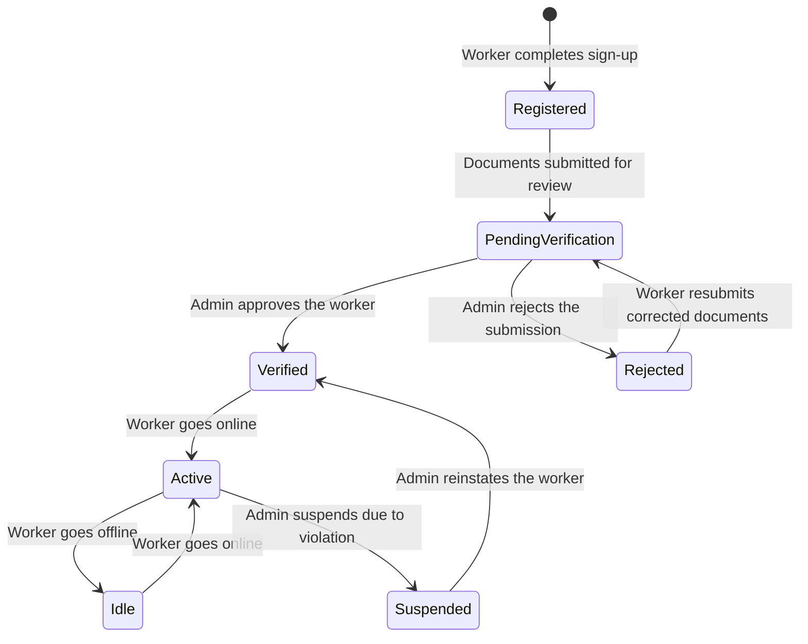
```mermaid
stateDiagram-v2
    [*] --> Registered : Worker completes sign-up

    Registered --> PendingVerification : Documents submitted for review

    PendingVerification --> Verified : Admin approves the worker
    PendingVerification --> Rejected : Admin rejects the submission

    Rejected --> PendingVerification : Worker resubmits corrected documents

    Verified --> Active : Worker goes online
    Active --> Idle : Worker goes offline
    Idle --> Active : Worker goes online

    Active --> Suspended : Admin suspends due to violation
    Suspended --> Verified : Admin reinstates the worker
```

## 6. Process Architecture

### 6.1 Process View

The process view focuses on the runtime behavior of the Home Service Management System and explains how different components interact during execution. It describes how user requests flow through the system, from the presentation layer to the application layer and finally to the data layer.

In this system, all interactions begin at the web interface, where users such as customers, employees, and administrators perform actions like logging in, searching for services, submitting requests, or managing system data. These actions are sent to the application server, which handles the business logic and communicates with the database to store or retrieve the required information.

The system is designed to support multiple users at the same time. Customers can search for services and request them, employees can review and respond to service requests, and administrators can manage employees and monitor activities. Since each request is handled independently by the application server, the system supports concurrent usage without conflicts between users.

The process view also addresses important quality concerns such as performance and scalability. For example, search operations should return results quickly, and the system should be able to support more users and requests in the future. Because the application is web-based, its processes are distributed between the client side, the server side, and the database layer.

The dynamic behavior of the system can be represented using UML diagrams such as sequence diagrams, activity diagrams, and communication diagrams.

---

### 6.2 Main Runtime Processes

The main runtime processes in the Home Service Management System include the following:

- Customer registration and login
- Searching for services by type and area
- Viewing employee profiles
- Sending a service request
- Employee receiving a request and accepting or rejecting it
- Admin approving employees
- Admin monitoring service requests and ratings
  
___

### 6.3 Sequence Diagram – Customer Requests a Service

  

<b>Figure 6.1:</b>Sequence Diagram – Customer Requests a Service 

## 7. Development Architecture

### 7.1. Database Technology Stack

| Component       | Technology    | Rationale                                                                                      |
|-----------------|---------------|------------------------------------------------------------------------------------------------|
| **RDBMS**       | PostgreSQL 16 | The most suitable, reliable, and open-source solution for the system's relational data structure. |
| **Local Environment** | Docker  | Ensures the exact same database version runs on all team members' machines without setup conflicts. |
| **ORM**         | SQLAlchemy    | The Python ecosystem's most mature ORM; standardizes all data exchange between the Database and Backend layers. |
| **Migrations**  | Alembic       | Works natively with SQLAlchemy to version-control schema changes across the team.               |

### 7.2. Entity-Relationship (ER) Model

The following model illustrates the core data structures of the system (Users, Worker Profiles, Service Categories, and Bookings) and their relationships:

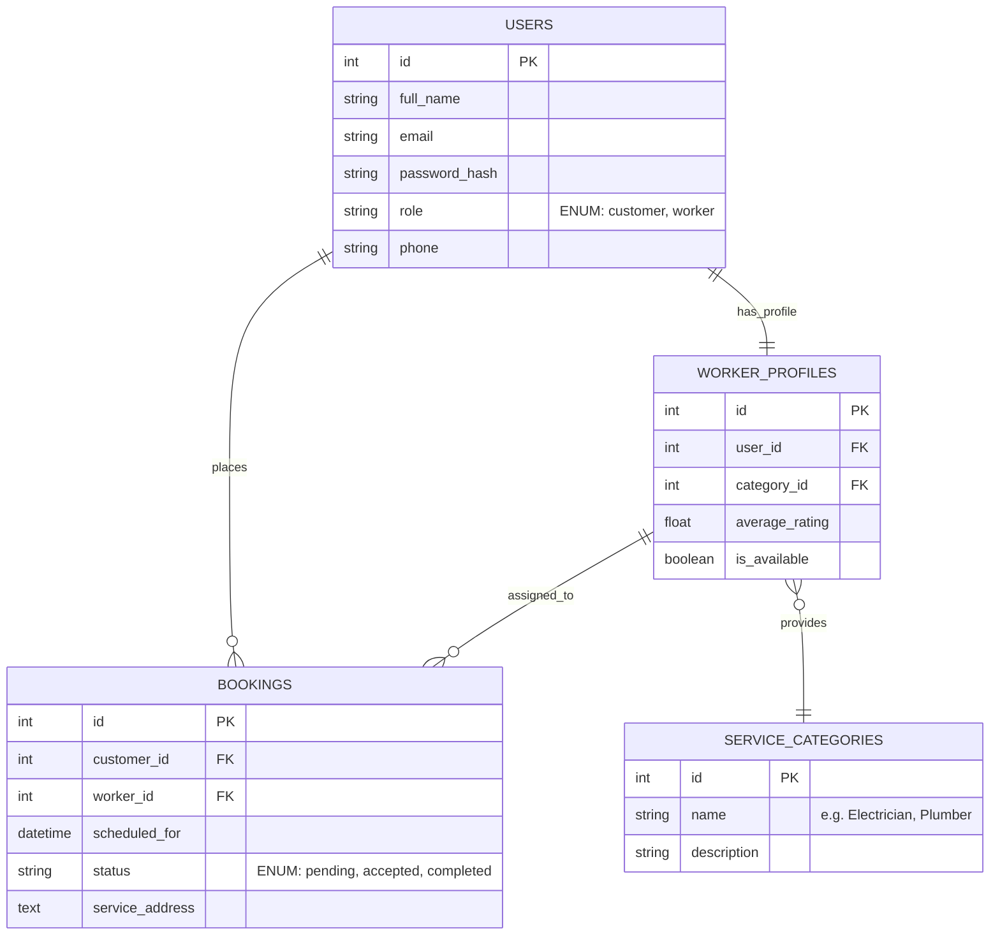
```mermaid
erDiagram
    USERS ||--o{ BOOKINGS : "places"
    USERS ||--|| WORKER_PROFILES : "has_profile"

    USERS {
        int id PK
        string full_name
        string email
        string password_hash
        string role "ENUM: customer, worker"
        string phone
    }

    WORKER_PROFILES ||--o{ BOOKINGS : "assigned_to"
    WORKER_PROFILES }o--|| SERVICE_CATEGORIES : "provides"

    WORKER_PROFILES {
        int id PK
        int user_id FK
        int category_id FK
        float average_rating
        boolean is_available
    }

    SERVICE_CATEGORIES {
        int id PK
        string name "e.g. Electrician, Plumber"
        string description
    }

    BOOKINGS {
        int id PK
        int customer_id FK
        int worker_id FK
        datetime scheduled_for
        string status "ENUM: pending, accepted, completed"
        text service_address
    }
```

### 7.3. Component Diagram

The following diagram shows the high-level components of the system and the communication protocols between them. It serves as a roadmap for how the Frontend, Backend, and Database teams collaborate and integrate their work.

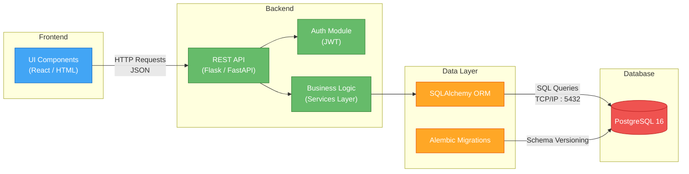
```mermaid
graph LR
    subgraph Frontend
        UI["UI Components<br/>(React / HTML)"]
    end

    subgraph Backend
        API["REST API<br/>(Flask / FastAPI)"]
        Auth["Auth Module<br/>(JWT)"]
        BL["Business Logic<br/>(Services Layer)"]
    end

    subgraph Data Layer
        ORM["SQLAlchemy ORM"]
        MIG["Alembic Migrations"]
    end

    subgraph Database
        PG[("PostgreSQL 16")]
    end

    UI -->|"HTTP Requests<br/>JSON"| API
    API --> Auth
    API --> BL
    BL --> ORM
    ORM -->|"SQL Queries<br/>TCP/IP : 5432"| PG
    MIG -->|"Schema Versioning"| PG

    classDef fe fill:#42A5F5,stroke:#1565C0,color:#fff
    classDef be fill:#66BB6A,stroke:#2E7D32,color:#fff
    classDef dl fill:#FFA726,stroke:#E65100,color:#fff
    classDef db fill:#EF5350,stroke:#B71C1C,color:#fff

    class UI fe
    class API,Auth,BL be
    class ORM,MIG dl
    class PG db
```

### 7.4. Package Diagram

This diagram illustrates the internal package structure of the project from the database developer's perspective, showing how modules are organized and which packages depend on each other.

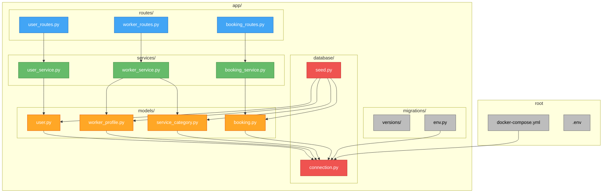
```mermaid
graph TD
    subgraph "app/"
        subgraph "routes/"
            R_USER["user_routes.py"]
            R_BOOK["booking_routes.py"]
            R_WORK["worker_routes.py"]
        end

        subgraph "services/"
            S_USER["user_service.py"]
            S_BOOK["booking_service.py"]
            S_WORK["worker_service.py"]
        end

        subgraph "models/"
            M_USER["user.py"]
            M_WORK["worker_profile.py"]
            M_CAT["service_category.py"]
            M_BOOK["booking.py"]
        end

        subgraph "database/"
            DB_CONN["connection.py"]
            DB_SEED["seed.py"]
        end

        subgraph "migrations/"
            MIG_V["versions/"]
            MIG_ENV["env.py"]
        end
    end

    subgraph "root"
        DC["docker-compose.yml"]
        ENV[".env"]
    end

    R_USER --> S_USER
    R_BOOK --> S_BOOK
    R_WORK --> S_WORK

    S_USER --> M_USER
    S_BOOK --> M_BOOK
    S_WORK --> M_WORK
    S_WORK --> M_CAT

    M_USER --> DB_CONN
    M_WORK --> DB_CONN
    M_CAT --> DB_CONN
    M_BOOK --> DB_CONN

    DB_SEED --> M_USER
    DB_SEED --> M_WORK
    DB_SEED --> M_CAT
    DB_SEED --> M_BOOK

    MIG_ENV --> DB_CONN
    DC --> DB_CONN

    classDef route fill:#42A5F5,stroke:#1565C0,color:#fff
    classDef service fill:#66BB6A,stroke:#2E7D32,color:#fff
    classDef model fill:#FFA726,stroke:#E65100,color:#fff
    classDef db fill:#EF5350,stroke:#B71C1C,color:#fff
    classDef infra fill:#BDBDBD,stroke:#616161,color:#000

    class R_USER,R_BOOK,R_WORK route
    class S_USER,S_BOOK,S_WORK service
    class M_USER,M_WORK,M_CAT,M_BOOK model
    class DB_CONN,DB_SEED db
    class MIG_V,MIG_ENV,DC,ENV infra
```

### 7.5. Data Dictionary

#### USERS

| Column        | Type         | Constraints                        | Description                        |
|---------------|-------------|------------------------------------|------------------------------------|
| id            | SERIAL       | PK                                 | Auto-incremented unique identifier |
| full_name     | VARCHAR(100) | NOT NULL                           | User's full name                   |
| email         | VARCHAR(150) | NOT NULL, UNIQUE                   | Login email address                |
| password_hash | VARCHAR(255) | NOT NULL                           | Bcrypt-hashed password             |
| role          | VARCHAR(20)  | NOT NULL, CHECK (customer/worker)  | Determines user type               |
| phone         | VARCHAR(20)  | NULLABLE                           | Optional contact number            |

#### WORKER_PROFILES

| Column         | Type    | Constraints                  | Description                              |
|----------------|---------|------------------------------|------------------------------------------|
| id             | SERIAL  | PK                           | Auto-incremented unique identifier       |
| user_id        | INTEGER | FK → USERS.id, UNIQUE        | One-to-one link to the USERS table       |
| category_id    | INTEGER | FK → SERVICE_CATEGORIES.id   | The service category this worker offers  |
| average_rating | FLOAT   | DEFAULT 0.0                  | Calculated average from completed jobs   |
| is_available   | BOOLEAN | DEFAULT TRUE                 | Whether the worker is currently active   |

#### SERVICE_CATEGORIES

| Column      | Type         | Constraints      | Description                          |
|-------------|-------------|------------------|--------------------------------------|
| id          | SERIAL       | PK               | Auto-incremented unique identifier   |
| name        | VARCHAR(100) | NOT NULL, UNIQUE | Category label (e.g. Electrician)    |
| description | TEXT         | NULLABLE         | Optional explanation of the category |

#### BOOKINGS

| Column        | Type         | Constraints                                  | Description                          |
|---------------|-------------|----------------------------------------------|--------------------------------------|
| id            | SERIAL       | PK                                           | Auto-incremented unique identifier   |
| customer_id   | INTEGER      | FK → USERS.id                                | The customer who placed the booking  |
| worker_id     | INTEGER      | FK → WORKER_PROFILES.id                      | The assigned worker                  |
| scheduled_for | TIMESTAMP    | NOT NULL                                     | Requested date and time of service   |
| status        | VARCHAR(20)  | NOT NULL, DEFAULT 'pending', CHECK (pending/accepted/completed) | Current state of the booking |
| service_address | TEXT       | NOT NULL                                     | Where the service will be performed  |

### 7.6. Demo Seed Data

Since this is a demo project, the database is pre-loaded with sample data for presentation purposes. The `seed.sql` file includes sample customers, workers across different service categories, and bookings in various statuses to demonstrate all system flows.

---

## 8. Physical Architecture

### 8.1. Local Deployment (Development Stage)

Since the project is in the development and demo stage, no cloud server is used. The entire database runs inside a Docker container on each developer's local machine.

| Layer              | Detail                          |
|--------------------|---------------------------------|
| **Host Machine**   | Developer's computer (Localhost)|
| **Containerization** | Docker Engine + Docker Compose |
| **Database Port**  | `5432` (mapped from container)  |
| **Data Persistence** | Docker Volume → local disk    |
| **Startup Command** | `docker-compose up -d`         |

The project root contains a ready-to-use `docker-compose.yml` file. Any team member can start the database with a single command without installing PostgreSQL locally.

### 8.2. Deployment Diagram

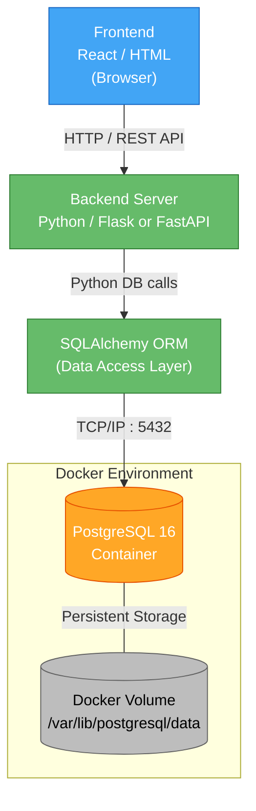
```mermaid
graph TD
    Client["Frontend<br/>React / HTML<br/>(Browser)"]
    Backend["Backend Server<br/>Python / Flask or FastAPI"]
    ORM["SQLAlchemy ORM<br/>(Data Access Layer)"]

    subgraph Docker Environment
        DB[("PostgreSQL 16<br/>Container")]
        Volume[("Docker Volume<br/>/var/lib/postgresql/data")]
    end

    Client -->|"HTTP / REST API"| Backend
    Backend -->|"Python DB calls"| ORM
    ORM -->|"TCP/IP : 5432"| DB
    DB ---|"Persistent Storage"| Volume

    classDef frontend fill:#42A5F5,stroke:#1565C0,color:#fff
    classDef backend fill:#66BB6A,stroke:#2E7D32,color:#fff
    classDef db fill:#FFA726,stroke:#E65100,color:#fff
    classDef volume fill:#BDBDBD,stroke:#616161,color:#000

    class Client frontend
    class Backend,ORM backend
    class DB db
    class Volume volume
```

## 9. Scenarios
## 9. Scenarios

The scenarios view — also known as the use case view — illustrates the architecture through a focused set of use cases that capture the most significant sequences of interactions between actors and system objects. Each scenario validates that the architectural elements defined in the other views work together correctly to deliver end-user value.

The system involves three primary actors:

- **Customer** — requests and pays for home services.
- **Worker** — accepts and fulfils service requests.
- **Admin** — governs the platform, verifies workers, and resolves disputes.

---

### Overview — System Use Case Diagram

The diagram below gives a high-level picture of all actors and their main interactions with the system.

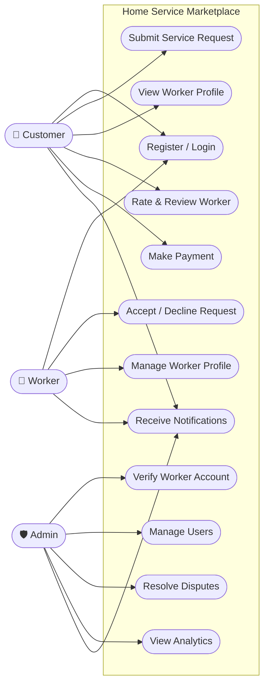
```mermaid
graph LR
    C(["👤 Customer"])
    W(["🔧 Worker"])
    A(["🛡️ Admin"])

    subgraph HMS["Home Service Marketplace"]
        direction TB
        UC1(["Register / Login"])
        UC2(["Submit Service Request"])
        UC3(["View Worker Profile"])
        UC4(["Rate & Review Worker"])
        UC5(["Make Payment"])
        UC6(["Accept / Decline Request"])
        UC7(["Manage Worker Profile"])
        UC8(["Verify Worker Account"])
        UC9(["Manage Users"])
        UC10(["Resolve Disputes"])
        UC11(["View Analytics"])
        UC12(["Receive Notifications"])
    end

    C --> UC1
    C --> UC2
    C --> UC3
    C --> UC4
    C --> UC5
    C --> UC12

    W --> UC1
    W --> UC6
    W --> UC7
    W --> UC12

    A --> UC8
    A --> UC9
    A --> UC10
    A --> UC11
    A --> UC12
```

---

### SC-01 — Registration & Login

**Goal:** Allow users to register and authenticate on the platform.

**Actors:** Customer, Worker, Admin

**Architectural elements exercised:** `User`, `Customer`, `Worker`, `Admin`, `Notification`

#### Use Case Diagram

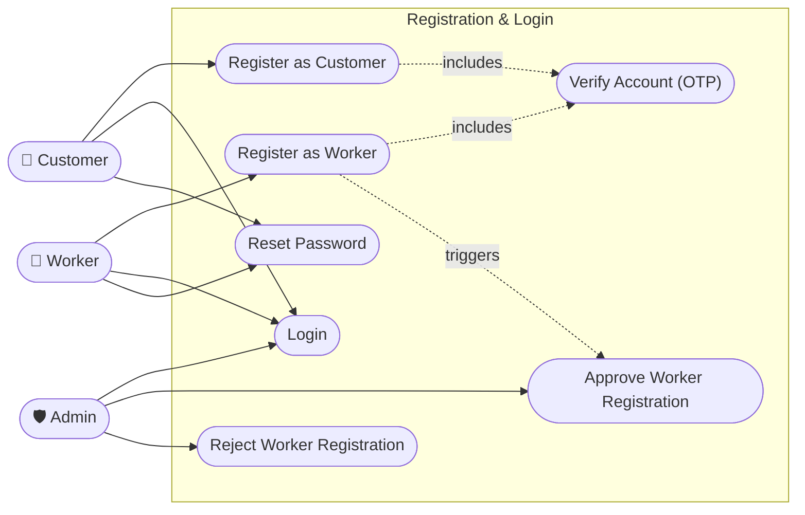
```mermaid
graph LR
    C(["👤 Customer"])
    W(["🔧 Worker"])
    A(["🛡️ Admin"])

    subgraph S["Registration & Login"]
        direction TB
        UC1(["Register as Customer"])
        UC2(["Register as Worker"])
        UC3(["Login"])
        UC4(["Reset Password"])
        UC5(["Verify Account (OTP)"])
        UC6(["Approve Worker Registration"])
        UC7(["Reject Worker Registration"])
    end

    C --> UC1
    C --> UC3
    C --> UC4
    UC1 -.->|includes| UC5

    W --> UC2
    W --> UC3
    W --> UC4
    UC2 -.->|includes| UC5

    A --> UC3
    A --> UC6
    A --> UC7
    UC2 -.->|triggers| UC6
```

#### Main Interaction Sequence — Customer Registration:

1. Customer submits registration form (name, email, phone, password).
2. System validates inputs and checks for a duplicate email.
3. System creates a `Customer` object and sends a verification `Notification` (OTP or email link).
4. Customer confirms the code; system activates the account.
5. Customer is redirected to the home screen.

#### Main Interaction Sequence — Worker Registration:

1. Worker submits personal details, selects service categories, and uploads ID documents.
2. System creates a `Worker` object (status: `PendingVerification`) and a linked `WorkerProfile`.
3. System creates an `Admin` alert `Notification` for review.
4. Admin reviews and approves; `Worker` status transitions to `Verified`.
5. Worker receives an activation `Notification`.

#### Main Interaction Sequence — Login:

1. User submits email and password.
2. System validates credentials and issues an authentication token.
3. User is redirected to their role-specific dashboard.

**Alternative Scenarios:**
- Wrong password (≥ 5 attempts) → account temporarily locked.
- OAuth login (Google) → identity verified externally, token issued directly.
- Forgot password → reset link sent via `Notification`.

---

### SC-02 — Service Request & Booking

**Goal:** Allow a Customer to request a service and a Worker to accept and confirm a booking.

**Actors:** Customer, Worker

**Architectural elements exercised:** `ServiceRequest`, `Booking`, `ServiceCategory`, `WorkerProfile`, `Notification`

#### Use Case Diagram

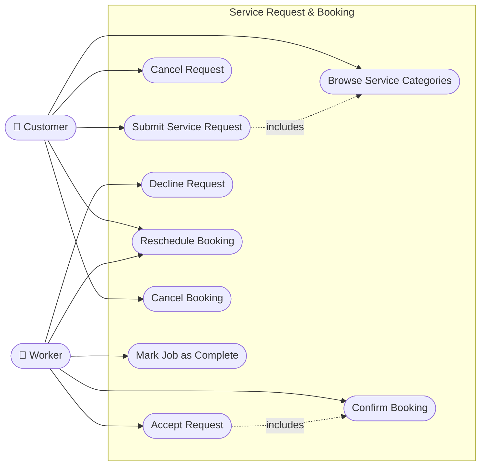
```mermaid
graph LR
    C(["👤 Customer"])
    W(["🔧 Worker"])

    subgraph S["Service Request & Booking"]
        direction TB
        UC1(["Browse Service Categories"])
        UC2(["Submit Service Request"])
        UC3(["Cancel Request"])
        UC4(["Accept Request"])
        UC5(["Decline Request"])
        UC6(["Confirm Booking"])
        UC7(["Reschedule Booking"])
        UC8(["Cancel Booking"])
        UC9(["Mark Job as Complete"])
    end

    C --> UC1
    C --> UC2
    C --> UC3
    C --> UC7
    C --> UC8
    UC2 -.->|includes| UC1

    W --> UC4
    W --> UC5
    W --> UC6
    W --> UC7
    W --> UC9
    UC4 -.->|includes| UC6
```

#### Main Interaction Sequence:

1. Customer selects a `ServiceCategory` and submits a `ServiceRequest` (description, location, preferred time).
2. System sets `ServiceRequest.status = Pending` and broadcasts a `Notification` to nearby available Workers.
3. Worker views the request details and accepts.
4. System sets `ServiceRequest.status = Assigned` and creates a `Booking` (status: `Scheduled`).
5. Both actors receive a booking confirmation `Notification`.
6. Worker confirms the scheduled time → `Booking.status = Confirmed`.
7. At the job start time → `Booking.status = InProgress`.
8. Worker marks the job as done → `Booking.status = Completed`, `ServiceRequest.status = Completed`.

**Alternative Scenarios:**
- No worker accepts within 24 hours → request expires; Customer is notified.
- Worker declines → request remains `Pending` and is offered to other Workers.
- Either party requests a reschedule → `Booking.status = Rescheduled`; new time must be mutually confirmed.
- Customer cancels before acceptance → `ServiceRequest.status = Cancelled` at no charge.

---

### SC-03 — Worker Profiles & Ratings

**Goal:** Allow Customers to evaluate Workers and submit reviews after a completed job.

**Actors:** Customer, Worker, Admin

**Architectural elements exercised:** `WorkerProfile`, `Rating`, `Booking`, `Notification`

#### Use Case Diagram

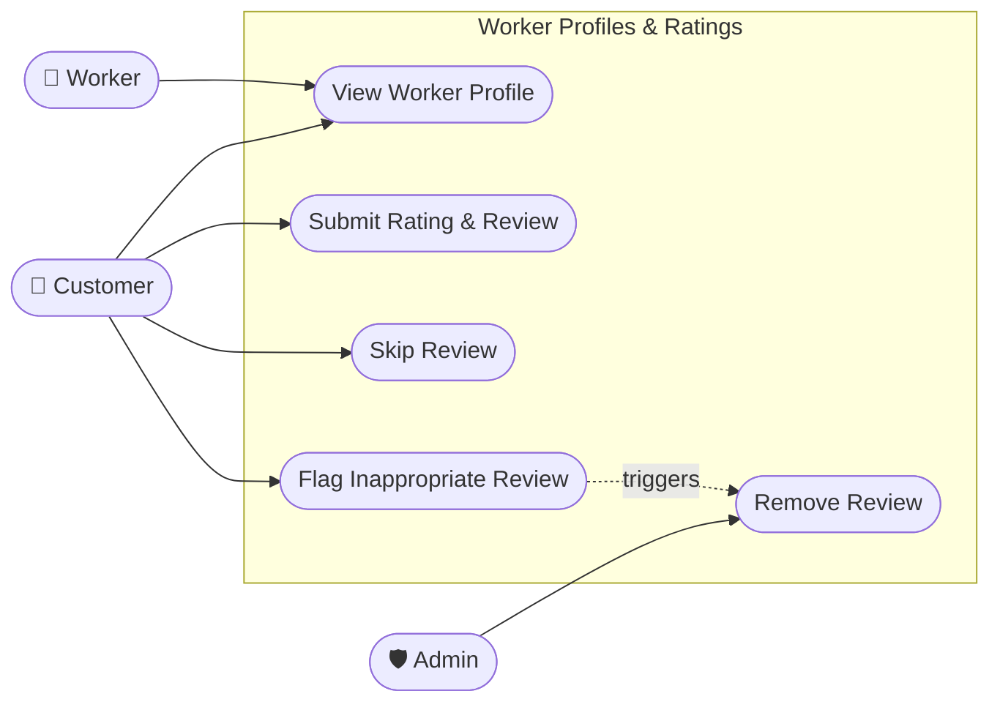
```mermaid
graph LR
    C(["👤 Customer"])
    W(["🔧 Worker"])
    A(["🛡️ Admin"])

    subgraph S["Worker Profiles & Ratings"]
        direction TB
        UC1(["View Worker Profile"])
        UC2(["Submit Rating & Review"])
        UC3(["Skip Review"])
        UC4(["Flag Inappropriate Review"])
        UC5(["Remove Review"])
    end

    C --> UC1
    C --> UC2
    C --> UC3
    C --> UC4

    W --> UC1

    A --> UC5
    UC4 -.->|triggers| UC5
```

#### Main Interaction Sequence — View Profile:

1. Customer views the matched Worker's profile.
2. System returns `WorkerProfile` data: bio, skills, hourly rate, average rating, and past reviews.
3. Customer decides to accept the match or request a different Worker.

#### Main Interaction Sequence — Submit Rating:

1. After `Booking.status = Completed`, system sends a rating prompt `Notification` to the Customer.
2. Customer submits a score (1–5) and an optional comment.
3. System creates a `Rating` object linked to the `Booking`.
4. System recalculates `WorkerProfile.averageRating`.
5. Worker receives a `Notification` informing them of the new review.

**Alternative Scenarios:**
- Customer skips the review → prompt expires after 7 days; booking archived without a rating.
- Admin removes a review flagged as inappropriate → `WorkerProfile.averageRating` is recalculated.

---

### SC-04 — Payment

**Goal:** Process payment from a Customer to a Worker upon job completion.

**Actors:** Customer, Worker, Admin

**Architectural elements exercised:** `Payment`, `Booking`, `Notification`

#### Use Case Diagram

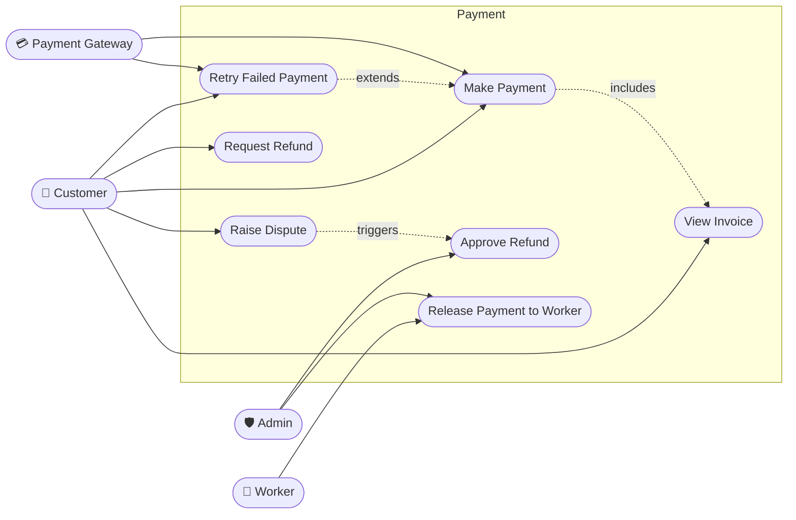
```mermaid
graph LR
    C(["👤 Customer"])
    W(["🔧 Worker"])
    A(["🛡️ Admin"])
    PG(["💳 Payment Gateway"])

    subgraph S["Payment"]
        direction TB
        UC1(["View Invoice"])
        UC2(["Make Payment"])
        UC3(["Retry Failed Payment"])
        UC4(["Raise Dispute"])
        UC5(["Request Refund"])
        UC6(["Approve Refund"])
        UC7(["Release Payment to Worker"])
    end

    C --> UC1
    C --> UC2
    C --> UC3
    C --> UC4
    C --> UC5
    UC2 -.->|includes| UC1
    UC3 -.->|extends| UC2

    W --> UC7

    A --> UC6
    A --> UC7
    UC4 -.->|triggers| UC6

    PG --> UC2
    PG --> UC3
```

#### Main Interaction Sequence:

1. `Booking.status` transitions to `Completed`; system generates a `Payment` (status: `Pending`).
2. System sends an invoice `Notification` to the Customer.
3. Customer reviews the amount and selects a payment method.
4. System forwards the request to the payment gateway → `Payment.status = Processing`.
5. Gateway confirms success → `Payment.status = Completed`.
6. Worker receives a payment confirmation `Notification`; funds are queued for payout.

**Alternative Scenarios:**
- Gateway returns an error → `Payment.status = Failed`; Customer is prompted to retry.
- Customer disputes the charge → payment held in escrow; Admin is notified to resolve.
- Admin approves a refund → system initiates reversal; `Payment.status = Refunded`; both parties notified.

---

### SC-05 — Admin Dashboard

**Goal:** Allow the Admin to govern users, monitor the platform, and resolve disputes.

**Actors:** Admin, Customer, Worker

**Architectural elements exercised:** `Admin`, `User`, `Worker`, `Booking`, `Payment`, `Rating`, `Notification`

#### Use Case Diagram

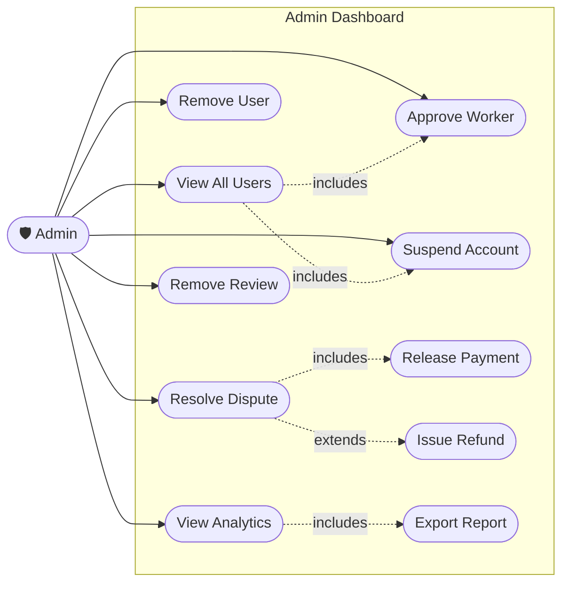
```mermaid
graph LR
    A(["🛡️ Admin"])

    subgraph S["Admin Dashboard"]
        direction TB
        UC1(["View All Users"])
        UC2(["Approve Worker"])
        UC3(["Suspend Account"])
        UC4(["Remove User"])
        UC5(["Resolve Dispute"])
        UC6(["Release Payment"])
        UC7(["Issue Refund"])
        UC8(["View Analytics"])
        UC9(["Export Report"])
        UC10(["Remove Review"])
    end

    A --> UC1
    A --> UC2
    A --> UC3
    A --> UC4
    A --> UC5
    A --> UC8
    A --> UC10
    UC5 -.->|includes| UC6
    UC5 -.->|extends| UC7
    UC8 -.->|includes| UC9
    UC1 -.->|includes| UC2
    UC1 -.->|includes| UC3
```

#### Main Interaction Sequence — User Management:

1. Admin filters users by role or status.
2. Admin opens a user's profile and reviews activity log and complaints.
3. Admin takes an action (approve, suspend, or remove); system updates the user's status.
4. Affected user receives a status-change `Notification`.

#### Main Interaction Sequence — Dispute Resolution:

1. A dispute is raised on a `Booking`; system creates an alert `Notification` for the Admin.
2. Admin reviews the booking timeline, messages, and submitted evidence.
3. Admin decides: release payment to Worker, approve refund to Customer, or request more evidence.
4. System executes the decision, updates `Payment.status` and `Booking.status`, and notifies both parties.

#### Main Interaction Sequence — Analytics:

1. Admin opens the Analytics dashboard.
2. System aggregates and displays metrics: active users, daily bookings, revenue, top service categories, and average ratings.
3. Admin applies date or category filters and exports the report.

---

### SC-06 — Real-time Notifications

**Goal:** Keep all actors informed of key events without requiring manual refresh.

**Actors:** Customer, Worker, Admin

**Architectural elements exercised:** `Notification`, `User`, `ServiceRequest`, `Booking`, `Payment`

#### Use Case Diagram

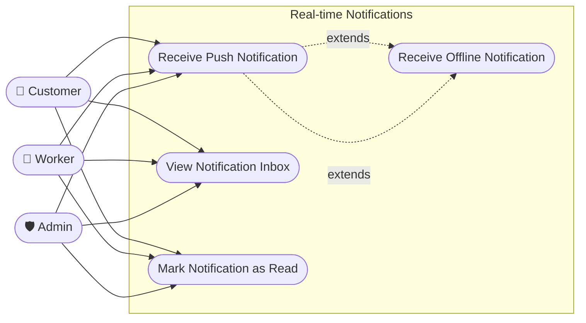
```mermaid
graph LR
    C(["👤 Customer"])
    W(["🔧 Worker"])
    A(["🛡️ Admin"])

    subgraph S["Real-time Notifications"]
        direction TB
        UC1(["Receive Push Notification"])
        UC2(["View Notification Inbox"])
        UC3(["Mark Notification as Read"])
        UC4(["Receive Offline Notification"])
    end

    C --> UC1
    C --> UC2
    C --> UC3
    UC1 -.->|extends| UC4

    W --> UC1
    W --> UC2
    W --> UC3
    UC1 -.->|extends| UC4

    A --> UC1
    A --> UC2
    A --> UC3
```

#### Main Interaction Sequence:

1. A triggering event occurs (e.g., booking confirmed, payment received, new request nearby).
2. System creates a `Notification` record associated with the target `User`.
3. System pushes the notification in real time via WebSocket.
4. User's notification badge updates instantly.
5. User opens the notification → system marks it `isRead = true`.

**Notification triggers by actor:**

| Actor | Trigger Events |
|---|---|
| **Customer** | Worker accepted request, booking confirmed, job completed, payment receipt, rating prompt, dispute resolved |
| **Worker** | New request nearby, booking confirmed, payment received, account status changed, new review posted |
| **Admin** | Worker pending verification, dispute raised, review flagged, system alert |

**Alternative Scenarios:**
- User is offline → notification is queued and delivered as a push notification on next app open.
- User has disabled push notifications → notification is stored in the in-app inbox only.

## 10. Size and Performance
(To be filled)

## 11. Quality
(To be filled)
