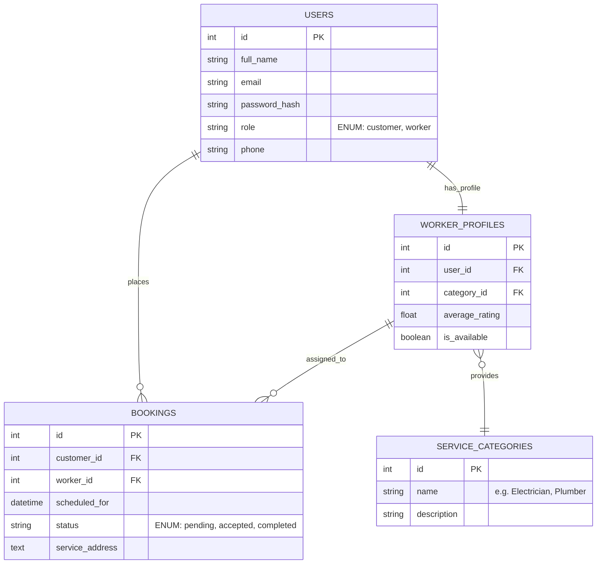
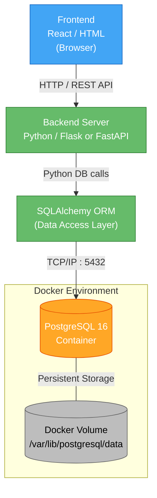

## Home Service Management System - software Architecture

## 1. Scope
(To be filled)

## 2. References
(To be filled)

## 3. Software Architecture
## 3.1 Architecture Overview

The system is designed using a three-tier architecture, which separates the application into three main layers: presentation, application, and data layers. This architectural style is chosen to ensure a clear separation of concerns and to improve system maintainability, scalability, and flexibility.

Each layer has a specific responsibility, allowing the system to be developed, modified, and extended more easily. This structure also supports future enhancements and efficient system management.

  

<b>Figure 3.1:</b> 3-Tier Architecture of Home Service System

---

## 3.2 Layer Description

### Presentation Layer

The presentation layer is responsible for the user interface of the system. It allows customers, employees, and administrators to interact with the application through web pages. It provides features such as login, service browsing, request creation, and profile management.

### Application Layer

The application layer contains the business logic of the system. It processes user requests, manages services, handles service requests, and controls system operations. It acts as a bridge between the user interface and the database.

### Data Layer

The data layer is responsible for storing and managing all system data. It includes information related to users, employees, services, service requests, and reviews. The application layer communicates with the database to retrieve and update data as needed.

This layered architecture improves maintainability, scalability, and separation of concerns.

---

## 3.3 Layer Interaction

The system follows a layered interaction where each layer communicates with the adjacent layer.

The user interacts with the presentation layer through the web interface. The presentation layer sends user requests to the application layer, where the business logic is executed. The application layer processes the request and communicates with the data layer to retrieve or store data.

After processing, the data is returned to the application layer, which then sends the response back to the presentation layer. Finally, the presentation layer displays the results to the user.

This structured interaction ensures a clear separation of responsibilities between layers and improves system maintainability and scalability.

## 4. Architectural Goals & Constraints
(To be filled)

## 5. Logical Architecture
(To be filled)

## 6. Process Architecture
(To be filled)

## 7. Development Architecture

### 7.1. Database Technology Stack

| Component       | Technology    | Rationale                                                                                      |
|-----------------|---------------|------------------------------------------------------------------------------------------------|
| **RDBMS**       | PostgreSQL 16 | The most suitable, reliable, and open-source solution for the system's relational data structure. |
| **Local Environment** | Docker  | Ensures the exact same database version runs on all team members' machines without setup conflicts. |
| **ORM**         | SQLAlchemy    | The Python ecosystem's most mature ORM; standardizes all data exchange between the Database and Backend layers. |
| **Migrations**  | Alembic       | Works natively with SQLAlchemy to version-control schema changes across the team.               |

### 7.2. Entity-Relationship (ER) Model

The following model illustrates the core data structures of the system (Users, Worker Profiles, Service Categories, and Bookings) and their relationships:

### 7.3. Data Dictionary

#### USERS

| Column        | Type         | Constraints                        | Description                        |
|---------------|-------------|------------------------------------|------------------------------------|
| id            | SERIAL       | PK                                 | Auto-incremented unique identifier |
| full_name     | VARCHAR(100) | NOT NULL                           | User's full name                   |
| email         | VARCHAR(150) | NOT NULL, UNIQUE                   | Login email address                |
| password_hash | VARCHAR(255) | NOT NULL                           | Bcrypt-hashed password             |
| role          | VARCHAR(20)  | NOT NULL, CHECK (customer/worker)  | Determines user type               |
| phone         | VARCHAR(20)  | NULLABLE                           | Optional contact number            |

#### WORKER_PROFILES

| Column         | Type    | Constraints                  | Description                              |
|----------------|---------|------------------------------|------------------------------------------|
| id             | SERIAL  | PK                           | Auto-incremented unique identifier       |
| user_id        | INTEGER | FK → USERS.id, UNIQUE        | One-to-one link to the USERS table       |
| category_id    | INTEGER | FK → SERVICE_CATEGORIES.id   | The service category this worker offers  |
| average_rating | FLOAT   | DEFAULT 0.0                  | Calculated average from completed jobs   |
| is_available   | BOOLEAN | DEFAULT TRUE                 | Whether the worker is currently active   |

#### SERVICE_CATEGORIES

| Column      | Type         | Constraints      | Description                          |
|-------------|-------------|------------------|--------------------------------------|
| id          | SERIAL       | PK               | Auto-incremented unique identifier   |
| name        | VARCHAR(100) | NOT NULL, UNIQUE | Category label (e.g. Electrician)    |
| description | TEXT         | NULLABLE         | Optional explanation of the category |

#### BOOKINGS

| Column        | Type         | Constraints                                  | Description                          |
|---------------|-------------|----------------------------------------------|--------------------------------------|
| id            | SERIAL       | PK                                           | Auto-incremented unique identifier   |
| customer_id   | INTEGER      | FK → USERS.id                                | The customer who placed the booking  |
| worker_id     | INTEGER      | FK → WORKER_PROFILES.id                      | The assigned worker                  |
| scheduled_for | TIMESTAMP    | NOT NULL                                     | Requested date and time of service   |
| status        | VARCHAR(20)  | NOT NULL, DEFAULT 'pending', CHECK (pending/accepted/completed) | Current state of the booking |
| service_address | TEXT       | NOT NULL                                     | Where the service will be performed  |

### 7.4. Demo Seed Data

Since this is a demo project, the database is pre-loaded with sample data for presentation purposes. The `seed.sql` file includes sample customers, workers across different service categories, and bookings in various statuses to demonstrate all system flows.

---

## 8. Physical Architecture

### 8.1. Local Deployment (Development Stage)

Since the project is in the development and demo stage, no cloud server is used. The entire database runs inside a Docker container on each developer's local machine.

| Layer              | Detail                          |
|--------------------|---------------------------------|
| **Host Machine**   | Developer's computer (Localhost)|
| **Containerization** | Docker Engine + Docker Compose |
| **Database Port**  | `5432` (mapped from container)  |
| **Data Persistence** | Docker Volume → local disk    |
| **Startup Command** | `docker-compose up -d`         |

The project root contains a ready-to-use `docker-compose.yml` file. Any team member can start the database with a single command without installing PostgreSQL locally.

### 8.2. Deployment Diagram

## 9. Scenarios
(To be filled)

## 10. Size and Performance
(To be filled)

## 11. Quality
(To be filled)
