## Home Service Management System - software Architecture

----
## Table of Contents

1. Scope
2. References
3. Software Architecture
   - Architecture Overview
   - Layer Description
   - Layer Interaction
4. Architectural Goals & Constraints
   - Architectural Goals
   - Constraints
5. Logical Architecture
   - Overview
   - Class Diagram
   - State Diagrams
     - Service Request State Diagram
     - Booking State Diagram
     - Payment State Diagram
6. Process Architecture
   - Process View
   - Main Runtime Processes
   - Sequence Diagram – Customer Requests Service
   - Activity Diagram
   - Sequence Diagram – Admin Approves Employee
   - Communication Diagram
7. Development Architecture
   - Technology Stack
   - Database Design (ER Diagram)
   - Component Diagram
   - Package Diagram
   - Sample Data (Seed Data)
8. Physical Architecture
   - Deployment Overview
   - Deployment Diagram
9. Scenarios
   - Overview use case Diagram 
   - Sc-Registration and login
   - Sc-Service Requests and Booking 
   -  Sc-Payment
10. Size and Performance
11. Quality
12. Appendices
   - Acronyms and Abbreviations
   - Definitions
   - Design Principles

------
## List of Figures

- Figure 3.1: Three-Tier Architecture Diagram  
- Figure 5.1: UML Class Diagram  
- Figure 5.2: Service Request State Diagram  
- Figure 5.3: Booking State Diagram  
- Figure 5.4: Payment State Diagram  
- Figure 6.1: Sequence Diagram – Customer Requests Service  
- Figure 6.2: Activity Diagram  
- Figure 6.3: Sequence Diagram – Admin Approves Employee  
- Figure 6.4: Communication Diagram  
- Figure 7.1: Entity-Relationship (ER) Diagram  
- Figure 7.2: Component Diagram  
- Figure 7.3: Package Diagram  
- Figure 8.1: Deployment Diagram  
- Figure 9.1: System Overview Use Case Diagram  
- Figure 9.2: Use Case Diagram – Registration and Login  
- Figure 9.3: Use Case Diagram – Service Request and Booking  
- Figure 9.4: Use Case Diagram – Payment  

----

## 1. Scope

This scope defines the functional boundaries of the **Home Service System**, identifying the core responsibilities of the software and establishing the limits of the initial architectural implementation.

###  Functional Scope (In-Scope)
* **User Management & Authentication:** The system provides secure user registration and login for Customers, Service Providers, and Administrators. Each user has a profile and access permissions based on their role.
* **Service Discovery & Catalog:** A centralized directory allowing users to browse available service categories. The architecture supports dynamic metadata (descriptions, provider information).
* **Service Request Lifecycle:** A state-managed workflow that handles the full progression of a service request, from creation to final resolution. The request transitions through states such as "Pending", "Accepted", "Cancelled", and "Completed" based on user and worker actions.
* **Transaction Information Module:** The system manages service-related cost information. It supports displaying service prices so users can view estimated costs before requesting a service.
* **Synchronous Request Visibility System:** A mechanism that allows workers to view incoming service requests when they access their profile or dashboard, including booking updates and status changes through the web interface.
* **Feedback & Rating System:** The system allows users to provide ratings and feedback after completing a service to help maintain service quality.

###  Out-of-Scope
* **Physical Resource & Inventory Tracking:** The system does not provide modules for managing a provider’s physical tools, equipment, or supply chain logistics.
* **Native Offline Capabilities:** The application is architected as a "Web-First" platform; persistent offline data synchronization and local-first processing are excluded from this version.
* **Real-time Multimedia Communication:** High-bandwidth features such as live video streaming or integrated VOIP (Voice over IP) are outside the current architectural requirements.
* **Predictive Analytics & AI:** The system provides standard data retrieval; it does not include machine learning models for demand forecasting or automated surge pricing logic.

## 2. References

-Kruchten, P. (1995). The 4+1 view model of architecture. IEEE Software, 12(6), 42–50.

-Wikipedia contributors. (n.d.). 4+1 architectural view model. In Wikipedia. Retrieved March 28, 2026, from https://en.wikipedia.org/wiki/4%2B1_architectural_view_model

-Bass, L., Clements, P., & Kazman, R. (2012). Software architecture in practice (3rd ed.). Addison-Wesley.

-Sommerville, I. (2016). Software engineering (10th ed.). Pearson.

-Richards, M., & Ford, N. (2020). *Fundamentals of software architecture: An engineering approach*. O’Reilly Media.

-ISO/IEC. (2011). *ISO/IEC 25010: Systems and software quality requirements and evaluation (SQuaRE): System and software quality models*. International Organization for Standardization.

-Newman, S. (2015). *Building microservices: Designing fine-grained systems*. O’Reilly Media.  

-Kruchten, P. (2004). *The rational unified process: An introduction* (3rd ed.). Addison-Wesley.  
 

## 3. Software Architecture
### 3.1 Architecture Overview

The system is designed using a three-tier architecture, which separates the application into three main layers: presentation, application, and data layers. This architectural style is chosen to ensure a clear separation of concerns and to improve system maintainability, scalability, and flexibility.

Each layer has a specific responsibility, allowing the system to be developed, modified, and extended more easily. This structure also supports future enhancements and efficient system management.

  

<b>Figure 3.1:</b> 3-Tier Architecture of Home Service System

---

### 3.2 Layer Description

#### Presentation Layer

The presentation layer is responsible for the user interface of the system. It allows customers, employees, and administrators to interact with the application through web pages. It provides features such as login, service browsing, request creation, and profile management.

#### Application Layer

The application layer contains the business logic of the system. It processes user requests, manages services, handles service requests, and controls system operations. It acts as a bridge between the user interface and the database.

#### Data Layer

The data layer is responsible for storing and managing all system data. It includes information related to users, employees, services, service requests, and reviews. The application layer communicates with the database to retrieve and update data as needed.

This layered architecture improves maintainability, scalability, and separation of concerns.

---

### 3.3 Layer Interaction

The system follows a layered interaction where each layer communicates with the adjacent layer.

The user interacts with the presentation layer through the web interface. The presentation layer sends user requests to the application layer, where the business logic is executed. The application layer processes the request and communicates with the data layer to retrieve or store data.

After processing, the data is returned to the application layer, which then sends the response back to the presentation layer. Finally, the presentation layer displays the results to the user.

This structured interaction ensures a clear separation of responsibilities between layers and improves system maintainability and scalability.

## 4. Architectural Goals & Constraints

### 4.1 Architectural Goals

The architecture of the system is designed to meet both functional and non-functional requirements.

#### Functional Goals

- The system should allow users to search for home services easily  
- The system should enable customers to request services from employees  
- Employees should be able to accept or reject service requests  
- The admin should manage services, employees, and system activities  

#### Non-Functional Goals

- **Usability:** The system should provide an easy-to-use interface for all users  
- **Performance:** The system should respond quickly to user actions  
- **Security:** User data should be protected through authentication and authorization  
- **Scalability:** The system should support future growth  
- **Maintainability:** The system should be easy to update and modify
---

### 4.2 Constraints

-	The system is developed as a web application and does not support mobile platforms.

-	The project is constrained by limited development time due to academic deadlines, with the architecture document due on April 10, and the full project required to be completed before the Altınbaş University final exams in 2026.

- The system is designed for small to medium usage and is not intended for large-scale enterprise deployment.

- The system uses basic authentication and authorization mechanisms based on JWT (JSON Web Token), without advanced security features such as multi-factor authentication or encryption   enhancements.

- The database design may be updated and refined during the development process.

- The development team has limited experience with full-scale web application development.

- The system is designed for a limited number of users and does not include advanced scalability mechanisms such as load balancing or distributed systems.

- The system requires a stable internet connection for proper operation.

These goals and constraints guide the design decisions and define the limitations of the current system implementation.

## 5. Logical Architecture

The logical view is concerned with the functionality that the system provides to end-users. It describes the key domain abstractions of the Home Service Marketplace — the entities involved, their responsibilities, and how they relate and evolve over time. This view is represented using a UML Class Diagram and a set of State Diagrams.

---

### 5.1 Class Diagram

The class diagram captures the primary domain entities of the system and their structural relationships. It shows the three user roles (Customer, Worker, Admin) inheriting from a base User class, along with the core entities that support the platform's main features.

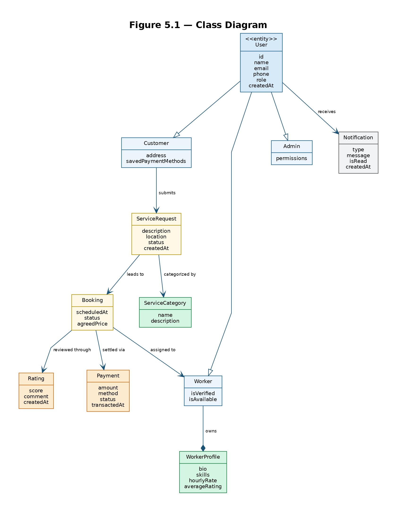

*Figure 5.1 — Class Diagram*

---

### 5.2 State Diagrams

State diagrams describe the lifecycle of the most behaviourally significant entities in the system — those whose status changes drive key interactions between actors.

---

#### 5.2.1 Service Request State Diagram

The Service Request lifecycle begins when a Customer submits a request and progresses through worker assignment, job execution, and completion. A Disputed state handles conflicts that require Admin intervention.

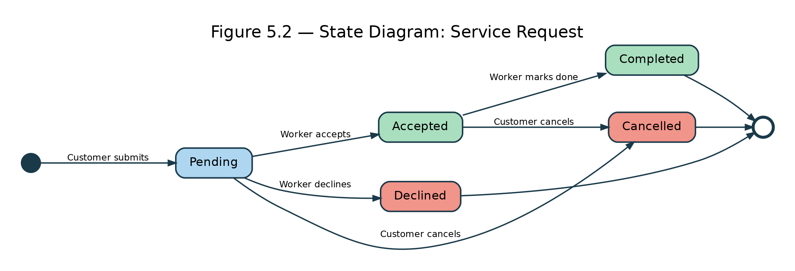

*Figure 5.2 — State Diagram: Service Request*

---

#### 5.2.2 Booking State Diagram

A Booking is created once a Worker accepts a Service Request. It tracks the agreement between Customer and Worker from scheduling through to job completion.

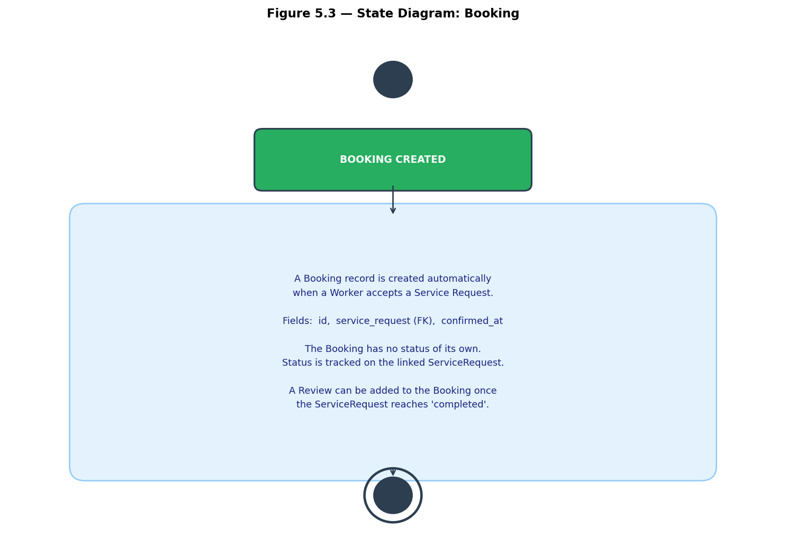

*Figure 5.3 — State Diagram: Booking*

---

#### 5.2.3 Payment State Diagram

The Payment lifecycle is triggered when a Booking is completed. It covers the customer payment flow, gateway processing, and handles failures and refunds.

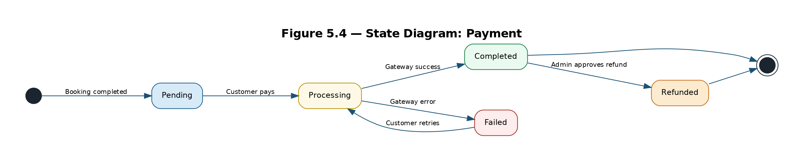

*Figure 5.4 — State Diagram: Payment*

## 6. Process Architecture

### 6.1 Process View

The process view focuses on the runtime behavior of the Home Service Management System and explains how different components interact during execution. It describes how user requests flow through the system, from the presentation layer to the application layer and finally to the data layer.

In this system, all interactions begin at the web interface, where users such as customers, employees, and administrators perform actions like logging in, searching for services, submitting requests, or managing system data. These actions are sent to the application server, which handles the business logic and communicates with the database to store or retrieve the required information.

The system is designed to support multiple users at the same time. Customers can search for services and request them, employees can review and respond to service requests, and administrators can manage employees and monitor activities. Since each request is handled independently by the application server, the system supports concurrent usage without conflicts between users.

The process view also addresses important quality concerns such as performance and scalability. For example, search operations should return results quickly, and the system should be able to support more users and requests in the future. Because the application is web-based, its processes are distributed between the client side, the server side, and the database layer.

The dynamic behavior of the system can be represented using UML diagrams such as sequence diagrams, activity diagrams, and communication diagrams.

---

### 6.2 Main Runtime Processes

The main runtime processes in the Home Service Management System include the following:

- Customer registration and login
- Searching for services by type and area
- Viewing employee profiles
- Sending a service request
- Employee receiving a request and accepting or rejecting it
- Admin approving employees
- Admin monitoring service requests and ratings
  
___

### 6.3 Sequence Diagram – Customer Requests a Service

  

<b>Figure 6.1:</b>Sequence Diagram – Customer Requests a Service 

This sequence diagram shows how a customer searches for a service, views available employees, and sends a service request. The request is processed by the application server, stored in the database, and then sent to the employee. The employee can accept or reject the request, and the system updates the request status accordingly.

### 6.4 Activity Diagram – Service Request Process

  
  

<b>Figure 6.2:</b> Activity diagram 

This activity diagram shows the workflow of requesting a service. The customer searches for a service, chooses an employee, and sends a request. The system stores the request and sends it to the employee. The employee then decides whether to accept or reject it, and the customer is informed of the result.

### 6.5 Sequence Diagram – Admin Approves Employee

  
 
  

<b>Figure 6.3:</b>Sequence Diagram-Admin Approves Employee 

This diagram shows how the admin checks pending employee applications and approves an employee. The application server updates the employee’s status in the database and returns the result to the admin panel.

### 6.6 Communication Diagram

Objects involved:
Customer
Web Interface
Application Server
Database
Employee

  
  
  

<b>Figure 6.4:</b>Communication Diagram 

Communication flow:
Customer sends search request to Web Interface
Web Interface sends request to Application Server
Application Server retrieves employee data from Database
Database returns data to Application Server
Application Server sends results to Web Interface
Customer submits service request
Application Server stores request in Database
Employee receives request notification
___

## 7. Development Architecture

The development view describes the system from a programmer's perspective. It focuses on the database technology choices, the data model, and the internal package organisation of the project.

---

### 7.1. Database Technology Stack

| Component            | Technology          | Rationale                                                                                          |
|----------------------|---------------------|----------------------------------------------------------------------------------------------------|
| **RDBMS**            | PostgreSQL 16       | The most suitable, reliable, and open-source solution for the system's relational data structure.   |
| **Local Environment**| Docker              | Ensures the exact same database version runs on all team members' machines without setup conflicts. |
| **ORM**              | Django ORM          | Built into the Django framework; standardizes all data exchange between the Database and Backend.   |
| **Migrations**       | Django Migrations   | Built into Django; version-controls all schema changes automatically across the team.              |

---

### 7.2. Entity-Relationship (ER) Model

The following model illustrates the core data structures of the system (Users, Worker Profiles, Service Categories, and Bookings) and their relationships. The full data dictionary for each entity is provided in the Appendices.

  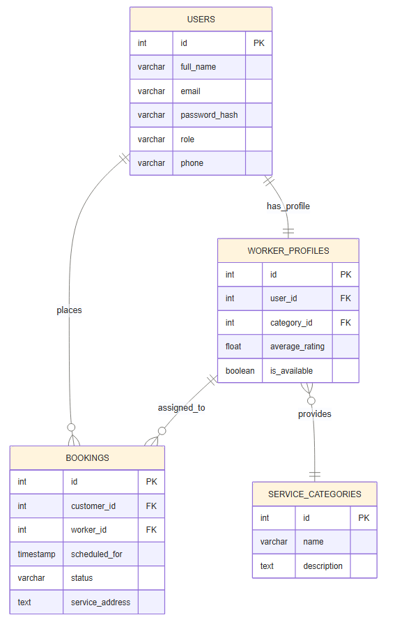

<b>Figure 7.1:</b> Entity-Relationship (ER) Diagram

---

### 7.3. Component Diagram

The following diagram shows the high-level components of the system and the communication protocols between them. It serves as a roadmap for how the Frontend, Backend, and Database teams collaborate and integrate their work.

  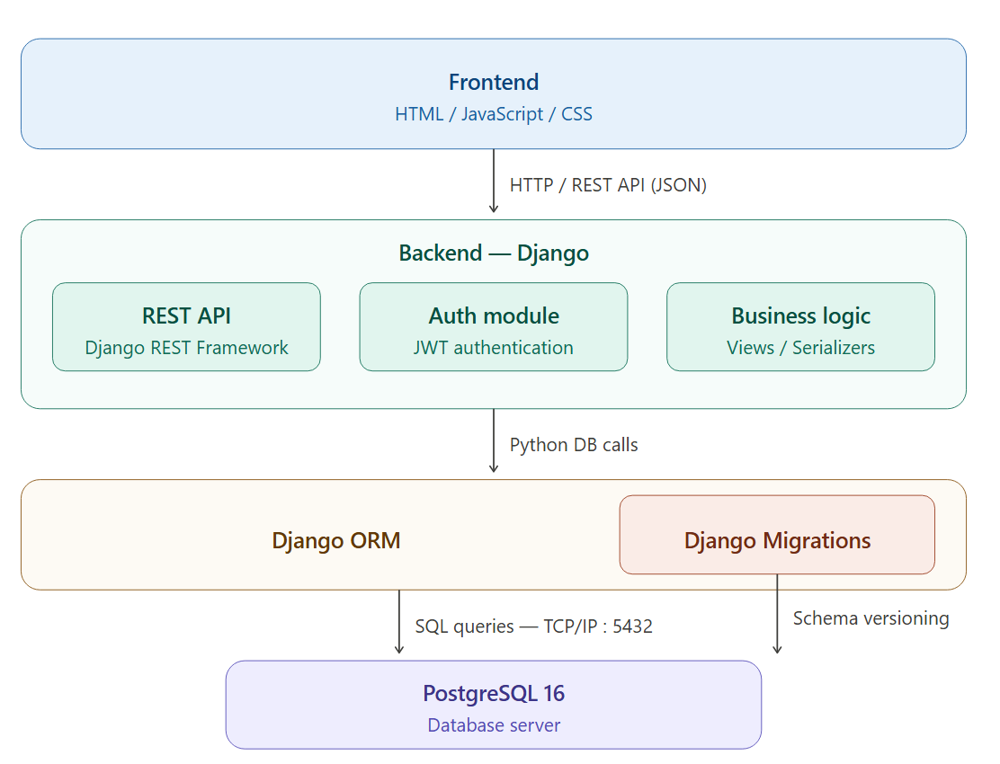

<b>Figure 7.2:</b> Component Diagram

---

### 7.4. Package Diagram

This diagram illustrates the internal package structure of the Django project from the database developer's perspective, showing how modules are organized and which packages depend on each other.

  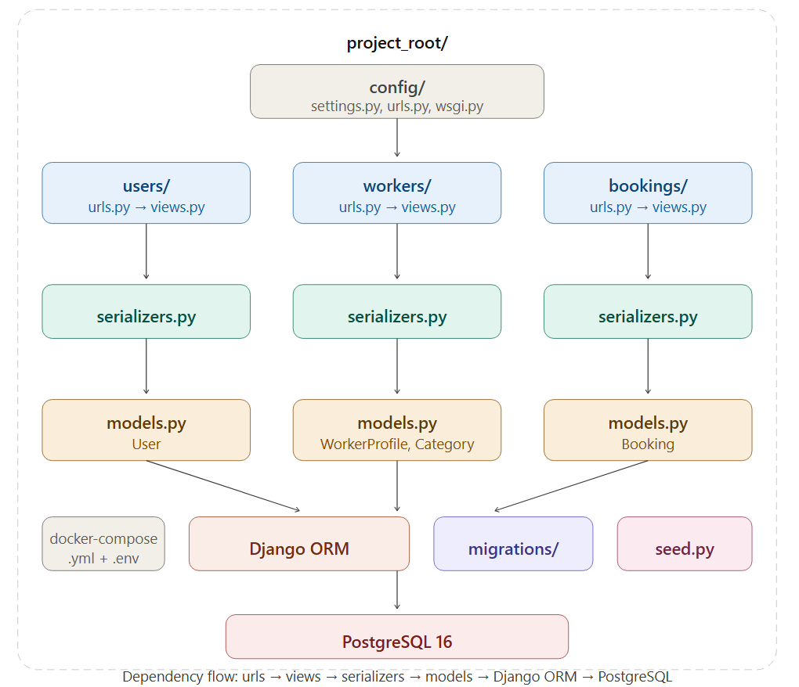

<b>Figure 7.3:</b> Package Diagram

---

### 7.5. Demo Seed Data

Since this is a demo project, the database is pre-loaded with sample data for presentation purposes. A Django management command (`python manage.py seed`) populates the database with sample customers, workers across different service categories, and bookings in various statuses to demonstrate all system flows.

---

## 8. Physical Architecture

The physical view describes the system from a deployment perspective. It shows the mapping of software components onto physical infrastructure. Since the project is currently in the development and demo stage, all components run on the developer's local machine.

---

### 8.1. Local Deployment (Development Stage)

The entire system runs locally using Docker to containerize the database. No cloud server is used at this stage.

| Layer                | Detail                           |
|----------------------|----------------------------------|
| **Host Machine**     | Developer's computer (Localhost) |
| **Containerization** | Docker Engine + Docker Compose   |
| **Database Port**    | `5432` (mapped from container)   |
| **Data Persistence** | Docker Volume → local disk       |
| **Startup Command**  | `docker-compose up -d`           |

The project root contains a ready-to-use `docker-compose.yml` file. Any team member can start the database with a single command without installing PostgreSQL locally.

---

### 8.2. Deployment Diagram

The diagram below shows how the Frontend, Backend (Django), and Database (PostgreSQL in Docker) are deployed on each developer's local machine during the development stage.

  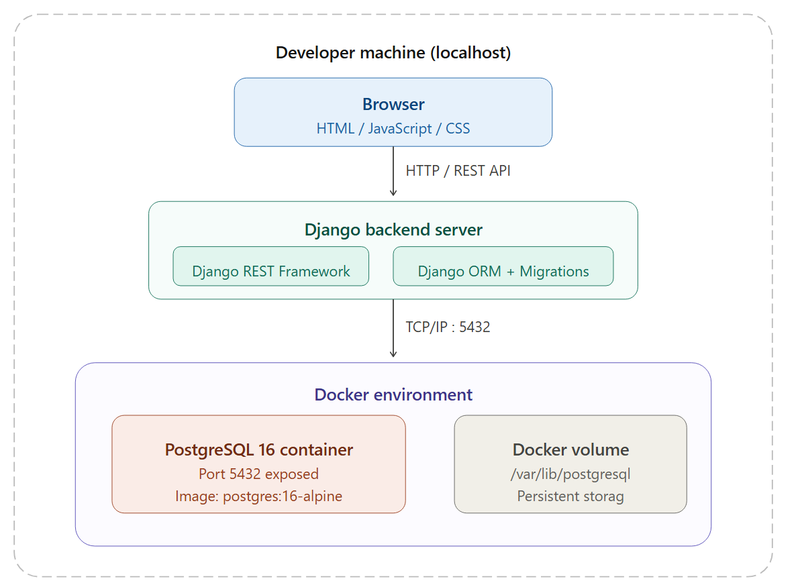

<b>Figure 8.1:</b> Deployment Diagram

---

## 9. Scenarios

The scenarios view — also known as the use case view — illustrates the architecture through a small set of use cases that describe the most significant sequences of interactions between actors and system objects. The scenarios are used to identify architectural elements and validate that the system design supports all core end-user needs.

The system involves three primary actors: **Customer** (requests and pays for home services), **Worker** (accepts and fulfils service requests), and **Admin** (governs the platform and verifies workers).

---

### Overview Use Case Diagram

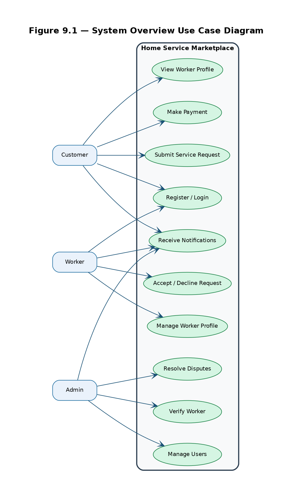

*Figure 9.1 — System Overview Use Case Diagram*

---

### SC-01 — Registration & Login

**Goal:** Allow users to register accounts and authenticate on the platform.  
**Actors:** Customer, Worker, Admin  
**Architectural elements exercised:** `User`, `Customer`, `Worker`, `Admin`, `Notification`

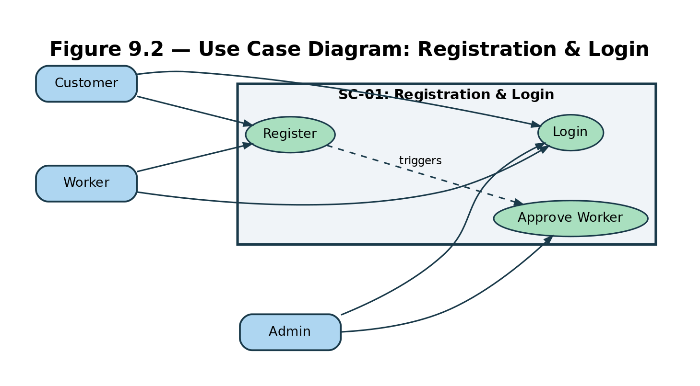

*Figure 9.2 — Use Case Diagram: Registration & Login*

**Main Flow — Customer:**
1. Customer fills in name, email, phone, and password and submits the registration form.
2. System validates inputs and sends a verification code.
3. Customer confirms the code; account is activated.
4. Customer logs in and is redirected to the home screen.

**Main Flow — Worker:**
1. Worker registers and uploads ID documents.
2. System creates the account with a *Pending Verification* status and alerts the Admin.
3. Admin reviews and approves; Worker receives an activation notification and can log in.

**Alternative Scenarios:**
- Wrong password → error message shown; account locked after 5 failed attempts.
- Forgot password → reset link sent by email.

---

### SC-02 — Service Request & Booking

**Goal:** Allow a Customer to post a service request and a Worker to accept and complete the job.  
**Actors:** Customer, Worker  
**Architectural elements exercised:** `ServiceRequest`, `Booking`, `ServiceCategory`, `Notification`

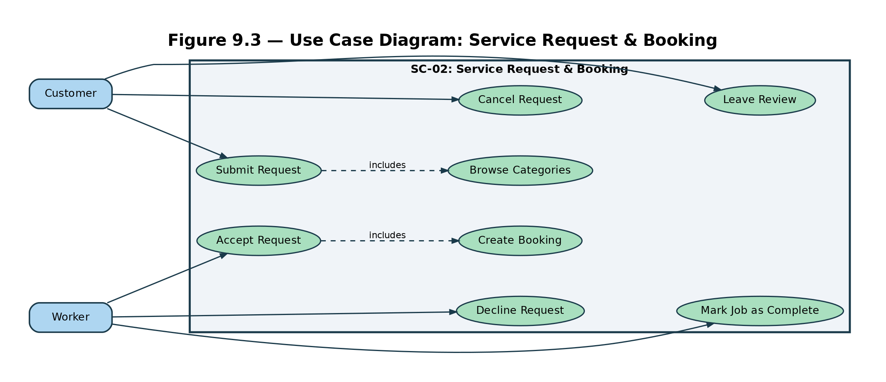

*Figure 9.3 — Use Case Diagram: Service Request & Booking*

**Main Flow:**
1. Customer browses service categories and submits a request with description, location, and preferred time.
2. System creates the `ServiceRequest` (status: *Pending*) and notifies nearby available Workers.
3. Worker reviews and accepts the request.
4. System creates a `Booking` (status: *Scheduled*) and notifies both parties.
5. Worker confirms the date and time → Booking becomes *Confirmed*.
6. Worker starts the job → status becomes *In Progress*.
7. Worker marks job done → Booking and ServiceRequest both move to *Completed*.

**Alternative Scenarios:**
- No Worker accepts within 24 hours → request expires; Customer is notified.
- Customer cancels before acceptance → request cancelled at no cost.

---

### SC-03 — Payment

**Goal:** Process the Customer's payment for a completed service.  
**Actors:** Customer, Admin  
**Architectural elements exercised:** `Payment`, `Booking`, `Notification`

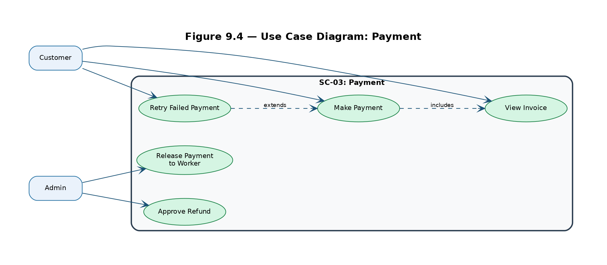

*Figure 9.4 — Use Case Diagram: Payment*

**Main Flow:**
1. Booking is marked *Completed*; system generates an invoice and notifies the Customer.
2. Customer reviews the invoice and selects a payment method.
3. System processes the payment through the gateway → status: *Processing*.
4. Gateway confirms success → `Payment` status becomes *Completed*.
5. Worker receives a payment confirmation notification.

**Alternative Scenarios:**
- Gateway error → *Failed* status; Customer prompted to retry.
- Admin approves a refund → payment reversed; both parties notified.

---
## 10. Size and Performance

The Home Service Management System is designed as a lightweight web application intended for small to medium-scale usage. The system is not expected to handle extremely large enterprise-level traffic but should perform efficiently for a moderate number of users such as customers, employees, and administrators.

### System Size
The system size is relatively small to medium, as it mainly consists of:
- A web interface (frontend)
- An application server (backend logic)
- A database for storing users, services, and requests

The database size is expected to grow gradually as more users register and more service requests are stored. However, the data structure is simple and manageable, making the system easy to maintain and extend.

### Performance Considerations
Performance is an important factor in this system, especially for user interactions such as searching for services and sending requests.

The system is designed to:
- Provide fast response times for search operations
- Process user requests efficiently without noticeable delays
- Handle multiple users at the same time (concurrent access)

Since the system follows a client-server architecture, the workload is mainly handled by the application server, which processes requests and communicates with the database.

### Scalability
Although the current version is designed for moderate usage, the system can be scaled in the future by:
- Improving database performance (indexing, optimization)
- Using more powerful servers
- Separating services into different modules if needed

### Limitations
- The system is not optimized for very large-scale applications with thousands of simultaneous users
- Performance may decrease if the number of users grows significantly without system upgrades

Overall, the system provides acceptable performance for its intended use and can be improved in future versions.

## 11. Quality

This section defines the non-functional requirements that the system architecture must satisfy to ensure high-quality service and a positive user experience. These attributes serve as the benchmark for evaluating the success of the Home Service System’s architectural design beyond its basic functional capabilities.

* **Availability** The system ensures users can access services without interruption during normal operation. 
    **Scenario:** In normal use, when a user searches or requests a service through the web application , the system backend responds by returning the requested data. The system must be available 99% of the time over a year.
  
* **Performance** The responsiveness of the web application is critical for user retention and efficient service matching.  
    **Scenario:** If there are 20 concurrent clients performing search requests through the Web Interface under normal operation, the system must display the results in less than 1 second.

* **Security** The system must ensure that only registered users with valid credentials can access private account features.  
    **Scenario:** If a user attempts to log in with an incorrect password through the Login Page during normal operation, the system must deny access and display an "Invalid Credentials" error message in less than 4 seconds.

* **Modifiability** The architecture must allow for the addition of new service categories or business rules with minimal manual effort.  
    **Scenario:** If a developer needs to add a new service category to the System Configuration during development time, the system must incorporate the change with less than 1 hour of manual effort.

* **Usability** The interface must be intuitive to minimize the learning curve for both customers and service providers.  
    **Scenario:** If a new customer performs a first-time booking task via the User Interface under normal operation, the user must successfully complete the workflow within 3 minutes.

* **Maintainability** The codebase must be structured to reduce technical debt and simplify the debugging process for developers.  
    **Scenario:** If a developer identifies a logic fault within the booking module during the maintenance phase, the developer must be able to isolate and  repair the bug with minimal side effects on other system modules.

* **Testability** The design must support simple testing to ensure the system works correctly before any new deployment.
    **Scenario:** During normal testing, if a developer runs a simple test on the booking feature in the system, the system displays the result in the console immediately within 3 seconds

---

## Appendices

### Acronyms and Abbreviations

- UI – User Interface
- API – Application Programming Interface
- DB – Database
- SQL – Structured Query Language
- HTTP – HyperText Transfer Protocol
- JSON – JavaScript Object Notation
- CRUD – Create, Read, Update, Delete
- MVC – Model-View-Controller
- ORM – Object-Relational Mapping
- RDBMS – Relational Database Management System
- JWT – JSON Web Token
  
#### Data Dictionary

The following tables describe the attributes, data types, and constraints for each entity in the database.

#### A.1 Users

| Column        | Type         | Constraints                       | Description                        |
|---------------|-------------|-----------------------------------|-------------------------------------|
| id            | SERIAL       | PK                                | Auto-incremented unique identifier |
| full_name     | VARCHAR(100) | NOT NULL                          | User's full name                   |
| email         | VARCHAR(150) | NOT NULL, UNIQUE                  | Login email address                |
| password_hash | VARCHAR(255) | NOT NULL                          | Hashed password                    |
| role          | VARCHAR(20)  | NOT NULL, CHECK (customer/worker) | Determines user type               |
| phone         | VARCHAR(20)  | NULLABLE                          | Optional contact number            |

#### A.2 Worker Profiles

| Column         | Type    | Constraints                | Description                            |
|----------------|---------|----------------------------|----------------------------------------|
| id             | SERIAL  | PK                         | Auto-incremented unique identifier     |
| user_id        | INTEGER | FK → USERS.id, UNIQUE      | One-to-one link to the USERS table     |
| category_id    | INTEGER | FK → SERVICE_CATEGORIES.id | The service category this worker offers|
| average_rating | FLOAT   | DEFAULT 0.0                | Calculated average from completed jobs |
| is_available   | BOOLEAN | DEFAULT TRUE               | Whether the worker is currently active |

#### A.3 Service Categories

| Column      | Type         | Constraints      | Description                          |
|-------------|-------------|------------------|--------------------------------------|
| id          | SERIAL       | PK               | Auto-incremented unique identifier   |
| name        | VARCHAR(100) | NOT NULL, UNIQUE | Category label (e.g. Electrician)    |
| description | TEXT         | NULLABLE         | Optional explanation of the category |

#### A.4 BOOKINGS

| Column          | Type        | Constraints                                                     | Description                        |
|-----------------|-------------|-----------------------------------------------------------------|------------------------------------|
| id              | SERIAL      | PK                                                              | Auto-incremented unique identifier |
| customer_id     | INTEGER     | FK → USERS.id                                                   | The customer who placed the booking|
| worker_id       | INTEGER     | FK → WORKER_PROFILES.id                                         | The assigned worker                |
| scheduled_for   | TIMESTAMP   | NOT NULL                                                        | Requested date and time of service |
| status          | VARCHAR(20) | NOT NULL, DEFAULT 'pending', CHECK (pending/accepted/completed) | Current state of the booking       |
| service_address | TEXT        | NOT NULL                                                        | Where the service will be performed|

### Definitions

- **Customer:** A user who searches for and requests home services
- **Employee:** A service provider such as a plumber, electrician, or cleaner
- **Admin:** The system administrator who manages users, services, and system activities
- **Service:** A type of work offered (e.g., plumbing, cleaning)
- **Service Request:** A request made by a customer to receive a service
- **Availability:** The time periods when an employee is available for work
- **Review:** Feedback provided by customers after service completion

### Design Principles

- **Separation of Concerns:** Each layer (frontend, backend, database) has a specific responsibility
- **Modularity:** The system is divided into independent modules for easier development
- **Reusability:** Components can be reused in different parts of the system
- **Scalability:** The system can be extended to support more users and features
- **Maintainability:** The system is designed to be easy to update and fix
- **Simplicity:** The design avoids unnecessary complexity

  
